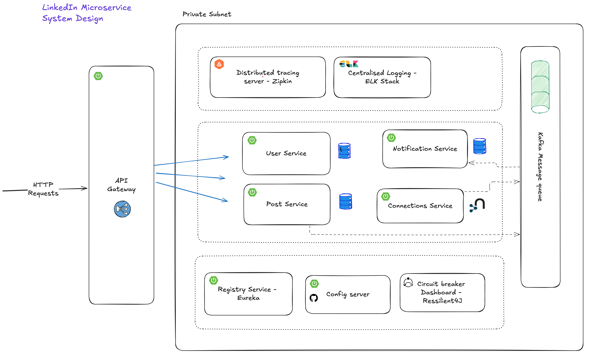

# 

CareerConnect is a scalable, microservices-based implementation of a professional networking platform inspired by LinkedIn. This project
demonstrates modern distributed systems architecture and cloud-native development practices.

## Features

- **User profile management and authentication**
- **Professional networking and connections**
- **Post creation and engagement (likes, comments)**
- **Real-time notifications**
- **Distributed caching**
- **Centralized logging and monitoring**
- **Fault tolerance and circuit breaking**

## Technology Stack

### Core Framework and Tools

- **Spring Boot**: Microservices development
- **Spring Cloud**: Distributed systems toolkit
- **Docker**: Containerization and deployment
- **JWT**: Authentication and authorization

### Databases and Caching

- **PostgreSQL**: Primary data store for users, posts, and notifications
- **Neo4j**: Graph database for managing user connections
- **Redis**: Distributed caching layer

### Message Queue and Communication

- **Apache Kafka**: Asynchronous event streaming
- **Spring Cloud OpenFeign**: Service-to-service communication

### Service Discovery and Configuration

- **Netflix Eureka**: Service registry and discovery
- **Spring Cloud Config Server**: Centralized configuration management
- **Spring Cloud Gateway**: API Gateway

### Monitoring and Resilience

- **ELK Stack (Elasticsearch, Logstash, Kibana)**: Logging and monitoring
- **Zipkin**: Distributed tracing
- **Resilience4j**: Circuit breaking and fault tolerance

### Deployment

- **Kubernetes (K8s)**: Deployment and orchestration
- **Google Cloud Platform (GKE)**: Cloud infrastructure for hosting

## System Architecture



### Microservices

- **User Service**: Account management, authentication, and user profiles
- **Post Service**: Content creation, likes, and comments
- **Connection Service**: Professional networking and user relationships
- **Notification Service**: Real-time user notifications
- **Config Server**: Centralized configuration management
- **API Gateway**: Request routing and load balancing
- **Zipkin Server**: Distributed tracing
- **ELK Stack**: Centralized logging
- **Circuit Breaker Dashboard**: Monitoring and fault tolerance

### Data Layer

- **PostgreSQL** databases for User, Post, and Notification services
- **Neo4j** graph database for Connection Service
- **Redis** caching layer across all services
- **Git-backed configuration repository**

### Infrastructure Components

- **Eureka Server** for service discovery
- **API Gateway** for request routing
- **Kafka** for event-driven communication
- **ELK Stack** for centralized logging

## Getting Started

### Prerequisites

- **Docker** and **Docker Compose**
- **Java 17 or higher**
- **Maven 3.8+**
- **Git**

### Installation

1. Clone the repository:

   ```bash
   git clone https://github.com/yourusername/linkedin-clone.git
   cd linkedin-clone
   ```

2. Configure environment variables:

   ```bash
   cp .env.example .env
   # Edit .env with your configuration
   ```

3. Start the application:

   ```bash
   docker-compose up -d
   ```

### Initial Configuration

The system will initialize in the following order:

1. Infrastructure services (databases, message queues)
2. Configuration server
3. Service discovery
4. Core microservices
5. API Gateway

Monitor service health:

- **Eureka Dashboard**: [http://localhost:8761](http://localhost:8761)
- **Kibana**: [http://localhost:5601](http://localhost:5601)
- **Zipkin**: [http://localhost:9411](http://localhost:9411)

## Development Workflow

1. **Services register with Eureka upon startup**
2. **Configuration is pulled from Config Server**
3. **API Gateway routes requests based on service registry**
4. Services communicate via:

- **Synchronous REST calls using Feign**
- **Asynchronous events via Kafka**

## Security

- **JWT-based authentication**
- **Private subnet isolation for internal services**
- **Rate limiting at API Gateway**
- **Circuit breakers for fault tolerance**
- **Secure configuration management**

## Monitoring and Logging

- **Centralized logging with ELK Stack**
- **Distributed tracing with Zipkin**
- **Circuit breaker monitoring with Resilience4j Dashboard**
- **Service health monitoring via Eureka**


